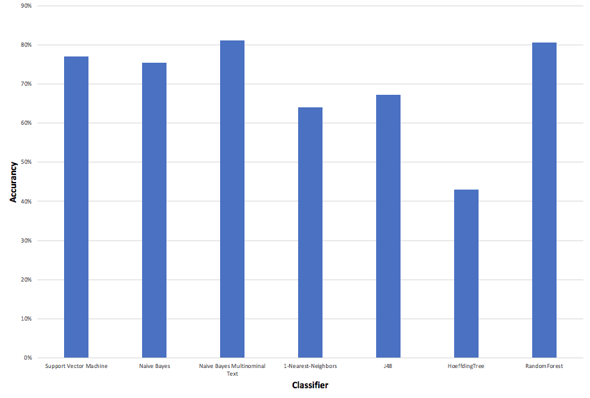
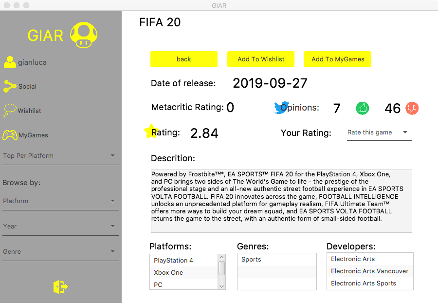

# Sentiment analysis

## Index

1. [Intoduction](#1-intoduction)
2. [Dataset description](#2-dataset-description)
3. [Classification in Weka](#3-classification-in-weka)
4. [Application](#4-application)


## 1. Introduction
GIAR (Games information and Ratings) is an application that collects information and ratings about videogames. A user can search a game by name using the search bar on the top of the homepage and then access to a page that contain informations about the game. 

The purpose of the project is to implement a sentiment analysis feature that gives to the user information about the players community opinions on the game. The opinions are obtained through tweets of the players around the world.

For each videogame selected by the user, the application will show the amount of `positive` and `negative` opinons the players express in their tweets regarding the game. The sentiment analysis is performed as a classification task on on-demand fetched tweets. Thus, the following steps are performed:
- Fetching tweets about the selected game through the Twitter API.
- Tweets preprocessing: Cleaning, Tokenization, Stop Words Removal, Stemming, BOW representation.
- Classification: positive, negative and none.

## 2 Dataset
The dataset used for train the model contains tweets about several games. First, we've retrieved tweets with the python library `GetOldTweets3`, searching for the game as keywords. The query is performed selecting english tweets. The result of the query contains several information, such as: 
- id 
- permalink
- username
- to
- text
- date
- retweets
- favorites
- mentions
- hashtags
- geo.

For the purpose of our analysis we stored only the text, that contains the effective tweet as displayed on Twitter.

Then, we labeled by hand the tweets in three classes: positive for tweets that contains good opinions about the game, negative for the tweets that contains bad opinions and none for the tweets that contains neutral opinion and/or spam. Since the dataset was strongly unbalanced, to obtain a balanced dataset we selected 333 instances per each minority class (positive and negative) from the labeled tweets and than we randomly picked 333 instances from the majority class (none) discarding the others. The dataset is so composed by 999 instances.

The instances were cleaned and stored together in an arff file. The cleaning process was performed with the python library `tweet-preprocessor`, removing useless informations such as: mentions, hashtags and links.

Here's a word cloud representation of the dataset created:


We noticed that the words composing the title of the games we looked for were more frequent that the ones that express an opinion (good, bad, etc.). To avoid the biasing of the classification model on that games we decided to remove the word composing the games title. The resulting dataset is:


## 3 Classification in Weka

### 3.1 Data pre-processing in Weka
In order to transform the cleaned tweets of the dataset into a `bag of words` representation we perform a three step pre-processing.

**First step:** we need to transform our stream of characters into a stream of processing units, called `tokens`. During this step, after removing punctuation marks, non-text characters and special symbols, each text is represented as a set of words. For removing redundancies between words tokens are converted in lower case. We use the `AlphabeticTokenizer` as tokenizer in Weka.

**Second step:** At this point we need to remove `stop-words`. Those are words providing little or no useful information to the sentiment analysis, for this reason they can be considered as noise. Stop-words are:
- Common stop-words include articles, conjunctions, prepositions, pronouns, etc.
- Other stop-words are those typically appearing very often in sentences of the considered language (language-specific stop-words), or in the particular context analyzed (domain-specific stop-words).
- We also included as stop-words the names of the console such as: `Playstation`, `Xbox`, `Pc`.

We use the `WordsFromFile` as stop-words handler in Weka. We used as list of the NLTK's list of common english stop words, including in the list the console names.

At the end of this step, each text is cleaned from stop-words, and thus reduced to a sequence of relevant tokens. We decided to dont't remove badwords from relevant tokens, because they can be usefull for our analysis as they might be very expressive regarding an opionion.

**Third step:** The last step is the `stemming`: the process of reducing each token to its stem or root form by removing its suffix, in order to group words having closely related semantics. At the end of this step each tweet is represented as a sequence of stems. We use the `english snowballStemmer` as stemmer.

At the end of this step we obtain the `bag of words` representation of the dataset. The attributes so transformed are selected using the `InfoGainAttributeEval` as evaluator and search `Ranker` with a threshold of -1000.

After the pre-processing we perform several tests with different classifiers and for each performing a `10-Fold-Cross-Validation`. We used a `filteredClassifier` to perform tests. A summarization of each test is below shown:

The `Naive Bayes Multinomial Text` don't need to be used as filtered classifier, the attribute selection with this classifier is not performed.

### 3.1 J48

**Correctly Classified Instances:** 672 (67.2673%)

**Incorrectly Classified Instances:** 327 (32.7327%)

**Kappa statistic:** 0.509 

**Mean absolute error:** 0.2498

**Root mean squared error:** 0.3922

**Relative absolute error:** 56.2143%

**Root relative squared error:** 83.1879%

**Total Number of Instances:** 999     

**Detailed Accuracy By Class**

 .|TP Rate | FP Rate|  Precision | Recall  | F-Measure | MCC  |    ROC Area | PRC Area | Class
 ---|----|----|----|----|----|----|----|----|----|
 -|0,625  |  0,135 |   0,698  |    0,625 |   0,659   |   0,504 |   0,804 |     0,670   |  positive
-|0,679  |  0,242  |  0,584   |   0,679 |   0,628   |   0,423 |   0,794 |     0,641  |   negative
  -|0,715  |  0,114  |  0,758   |   0,715   | 0,736  |    0,610 |   0,877   |  0,795  |   none
Weighted Avg. |   0,673 |   0,164   | 0,680  |    0,673  |  0,674   |   0,512 |   0,825    | 0,702     

**Confusion Matrix**

   positive|  negative|  none |  <-- classified as
   --|--|--|-------|
 208 | 96 | 29 |    positive
  60 | 226 | 47 |  negative
  30 | 65 | 238 |  none

### 3.2 Naive Bayes Multinominal Text

**Correctly Classified Instances:** 811 (81.1812%)

**Incorrectly Classified Instances:** 188 (18.8188%)

**Kappa statistic:** 0.7177

**Mean absolute error:** 0.1612

**Root mean squared error:** 0.2988

**Relative absolute error:** 36.2742%

**Root relative squared error:** 63.3739%

**Total Number of Instances:** 999     

**Detailed Accuracy By Class**

 .|TP Rate | FP Rate|  Precision | Recall  | F-Measure | MCC  |    ROC Area | PRC Area | Class
 ---|----|----|----|----|----|----|----|----|----|
 . | 0,874  |  0,176  |  0,713   |   0,874 |   0,785  |    0,670 |   0,927  |   0,847   |  positive
 . | 0,730  |  0,084   | 0,813  |    0,730  |  0,769     | 0,665  |  0,919  |   0,873   |  negative
. | 0,832 |   0,023  |  0,949   |   0,832  |  0,886   |   0,839  |  0,967  |   0,957  |   none
Weighted Avg.  |  0,812  |  0,094  |  0,825  |    0,812  |  0,814 |     0,724 |   0,938  |   0,892     

**Confusion Matrix**

   positive |  negative |  none |  <-- classified as
   --|--|--|-------|
291 | 33  | 9 |    positive
  84 | 243  | 6 |  negative
  33 | 23  | 277 |   none

### 3.3 1-Nearest-Neighbors

**Correctly Classified Instances:** 639 (63.964 %)

**Incorrectly Classified Instances:** 360 (36.036%)

**Kappa statistic:** 0.4595

**Mean absolute error:** 0.2488

**Root mean squared error:** 0.362

**Relative absolute error:** 55.9741%

**Root relative squared error:** 76.7899%

**Total Number of Instances:** 999    

**Detailed Accuracy By Class**

 .|TP Rate | FP Rate|  Precision | Recall  | F-Measure | MCC  |    ROC Area | PRC Area | Class
 ---|----|----|----|----|----|----|----|----|----|
  .|0,652 |   0,179  |  0,646   |   0,652  |  0,649   |   0,472  |  0,844   |  0,741  |   positive
 . |0,586  |  0,245  |  0,545   |   0,586  |  0,564   |   0,335  |  0,804  |   0,702  |   negative
 . | 0,682 |   0,117 |   0,744   |   0,682  |  0,712  |    0,578  |  0,902   |  0,860   |  none
Weighted Avg. |   0,640  |  0,180  |  0,645  |    0,640  |  0,642   |   0,462  |  0,850   |  0,767     

**Confusion Matrix**

   positive |  negative |  none |  <-- classified as
   --|--|--|-------|
   217 | 87 | 29 | positive
 89 | 195 | 49 | negative
  30 |  76  | 227 | none

### 3.4 RandomForest

**Correctly Classified Instances:** 804 (80.4805%)

**Incorrectly Classified Instances:** 195 (19.5195%)

**Kappa statistic:** 0.7072

**Mean absolute error:** 0.1303

**Root mean squared error:** 0.3445

**Relative absolute error:** 29.3178%

**Root relative squared error:** 73.0853%

**Total Number of Instances:** 999  

**Detailed Accuracy By Class**

 .|TP Rate | FP Rate|  Precision | Recall  | F-Measure | MCC  |    ROC Area | PRC Area | Class
 ---|----|----|----|----|----|----|----|----|----|
  . |0,862  |  0,155  |  0,736   |   0,862  |  0,794  |    0,683  |  0,910  |   0,802   |  positive
 .| 0,712 |   0,066  |  0,843  |    0,712 |   0,772  |    0,677  |  0,897  |   0,839  |   negative
 . | 0,841  |  0,072  |  0,854   |   0,841   | 0,847    |  0,772   | 0,942  |   0,916  |   none
Weighted Avg. |   0,805  |  0,098 |   0,811  |    0,805  |  0,804   |   0,711  |  0,916   |  0,852 

**Confusion Matrix**

   positive |  negative |  none |  <-- classified as
   --|--|--|-------|
   287 | 27 | 19 | positive
  67 | 237  | 29 | negative
  36 | 17  | 280 | none

### 3.5 HoeffdingTree

**Correctly Classified Instances:** 429 (42.9429%)

**Incorrectly Classified Instances:** 570 (57.0571%)

**Kappa statistic:** 0.1441

**Mean absolute error:** 0.3801

**Root mean squared error:** 0.6163

**Relative absolute error:** 85.524%

**Root relative squared error:** 130.7381%

**Total Number of Instances:** 999  

**Detailed Accuracy By Class**

 .|TP Rate | FP Rate|  Precision | Recall  | F-Measure | MCC  |    ROC Area | PRC Area | Class
 ---|----|----|----|----|----|----|----|----|----|
. | 0,222 |    0,054  |  0,673  |    0,222  |  0,334   |   0,253  |  0,793  |   0,605 |    positive
 . | 0,069  |  0,005  |  0,885  |    0,069  |  0,128   |   0,191  |  0,649  |   0,506  |   negative
 . | 0,997  |  0,797 |   0,385   |   0,997  |   0,555  |    0,275  |   0,604 |    0,387 |    none
Weighted Avg.  |  0,429 |   0,285 |   0,647   |   0,429   | 0,339   |   0,240 |   0,682  |   0,500     

**Confusion Matrix**

   positive |  negative |  none |  <-- classified as
   --|--|--|-------|
   74  | 3  | 256 |positive
  35 |  23 | 275 |negative
   1 |  0 | 332 |none

### 3.6 Naive Bayes


**Correctly Classified Instances:** 753 (75.3754%)

**Incorrectly Classified Instances:** 246 (24.6246%)

**Kappa statistic:** 0.6306

**Mean absolute error:** 0.194 

**Root mean squared error:** 0.3501

**Relative absolute error:** 43.6583%

**Root relative squared error:** 74.2731%

**Total Number of Instances:** 999  

**Detailed Accuracy By Class**

 .|TP Rate | FP Rate|  Precision | Recall  | F-Measure | MCC  |    ROC Area | PRC Area | Class
 ---|----|----|----|----|----|----|----|----|----|
 . | 0,769 |   0,140 |   0,734 |     0,769 |   0,751   |   0,622  |  0,897 |    0,814    | positive
. |0,835  |  0,228   | 0,647  |    0,835 |   0,729    |  0,578  |  0,889   |  0,814  |   negative
. | 0,658 |   0,002 |   0,995  |    0,658 |   0,792   |   0,746 |   0,931  |   0,910  |   none
Weighted Avg. |   0,754  |  0,123 |   0,792  |    0,754  |  0,757 |     0,649  |  0,905  |   0,846     

**Confusion Matrix**

   positive |  negative |  none |  <-- classified as
   --|--|--|-------|
   256 |  76  | 1 |positive
  55 | 278 |  0 |negative
  38  | 76 | 219 |none

### 3.7 Support Vector Machine


**Correctly Classified Instances:** 770 (77.0771%)

**Incorrectly Classified Instances:** 229 (22.9229%)

**Kappa statistic:** 0.6562

**Mean absolute error:** 0.1528

**Root mean squared error:** 0.3909

**Relative absolute error:** 34.384%

**Root relative squared error:** 82.9261%

**Total Number of Instances:** 999   

**Detailed Accuracy By Class**

 .|TP Rate | FP Rate|  Precision | Recall  | F-Measure | MCC  |    ROC Area | PRC Area | Class
 ---|----|----|----|----|----|----|----|----|----|
. | 0,745 |   0,144  |  0,721  |    0,745  |  0,733   |   0,596  |  0,800  |   0,622  |   positive
. | 0,721  |  0,108 |   0,769   |   0,721 |   0,744    |  0,623  |  0,806  |   0,647   |  negative
  . |0,847 |   0,092 |   0,822   |   0,847 |   0,834  |    0,750  |  0,878  |   0,747  |   none
Weighted Avg.  |  0,771  |  0,115  |  0,771   |   0,771  |  0,770  |    0,656 |   0,828   |  0,672 

**Confusion Matrix**

positive |  negative |  none |  <-- classified as
   --|--|--|-------|  
   248 |  53 | 32 |positive
  64  | 240 |  29 |negative
  32 | 19 | 282 |none

### 3.8 Comparison of classification models
A short summary of the accurancy of the classifiers:



The table below relates the various classifiers with the matching measures:

Classifier | Accurancy|  K-statistic | Precision  | Recall | F-Measure  |    ROC 
----|----|----|----|----|----|----|
Bayes Multinomial |  81.1812% | 0.7177 | 0,825  |    0,812  |  0,814 | 0,938
Random Forest | 81.0811% | 0.7162 | 0,818   |   0,811  |  0,810  | 0,933
SVM | 77.0771% | 0.6562 | 0,771   |   0,771  |  0,770 | 0,828
Naive Bayes |  75.3754% | 0.6306 | 0,792  |    0,754  |  0,757 | 0,905
J48 | 67.2673% | 0.509 | 0,680  | 0,673  |  0,674 | 0,825
1-NN |  63.964 % | 0.4595 | 0,645 | 0,640 | 0,642 | 0,850

To choose the best classifier we performed a paired t-test on the best two classifier obtained during the tests phase. So we performed the t-test between the `Random Forest`and `Naive Bayes Multinomial` in Weka. The result of the test is shown below:

```
Tester:     weka.experiment.PairedCorrectedTTester -G 4,5,6 -D 1 -R 2 -S 0.05 -result-matrix "weka.experiment.ResultMatrixPlainText -mean-prec 4 -stddev-prec 5 -col-name-width 0 -row-name-width 25 -mean-width 0 -stddev-width 0 -sig-width 0 -count-width 5 -print-col-names -print-row-names -enum-col-names"
Analysing:  Percent_correct
Datasets:   1
Resultsets: 2
Confidence: 0.05 (two tailed)
Sorted by:  Percent_correct
Date:       07/02/20 15.11


Dataset                   (1) meta.Filte | (2) bayes.N
------------------------------------------------------
_Users_gianluca_dataset  (100)   80.2507 |   80.7201  
------------------------------------------------------
                                 (v/ /*) |     (0/1/0)


Key:
(1) meta.FilteredClassifier '-F \"MultiFilter -F \\\"unsupervised.attribute.StringToWordVector -R first-last -W 1000 -prune-rate -1.0 -I -N 0 -L -stemmer \\\\\\\"weka.core.stemmers.SnowballStemmer -S english\\\\\\\" -stopwords-handler \\\\\\\"weka.core.stopwords.WordsFromFile -stopwords /Users/gianluca/stopwords.txt\\\\\\\" -M 1 -tokenizer weka.core.tokenizers.AlphabeticTokenizer\\\" -F \\\"supervised.attribute.AttributeSelection -E \\\\\\\"InfoGainAttributeEval \\\\\\\" -S \\\\\\\"Ranker -T -1000.0 -N -1\\\\\\\"\\\"\" -S 1 -W trees.RandomForest -- -P 100 -I 100 -num-slots 1 -K 0 -M 1.0 -V 0.001 -S 1' -4523450618538717400
(2) bayes.NaiveBayesMultinomialText '-W -P 0 -M 2.0 -norm 1.0 -lnorm 2.0 -lowercase -stopwords-handler \"weka.core.stopwords.WordsFromFile -stopwords /Users/gianluca/stopwords.txt\" -tokenizer weka.core.tokenizers.AlphabeticTokenizer -stemmer \"weka.core.stemmers.SnowballStemmer -S porter\"' 2139025532014821394
````

The best classifier is still the `Naive Bayes Multinomial Text`.

## 4 Application
### 4.1 Data Acquisition
Tweets are fetched whenever a user look for information about a game. To download tweets we used the official Twitter API with the `Twitter4j` java library.

To connect with Twitter we need to create a `Twitter` object from a `TwitterFactory`. The Twitter object is retrieved as a Singleton, so we have only one connection during a session. The query is performed using a `Query` object on which several paramenters can be specified. As for the training-set we fetched english tweets based on the game title.

An example of the fetching code:
```java
Twitter twitter;
Query query;
QueryResult result;
			
twitter = TwitterFactory.getSingleton();
tweets = new ArrayList<String>();
query = new Query(searchTerm);
query.setLang("en");
query.setCount(1000);
result = twitter.search(query);
```

The `setCount` option let specify the maximum number of tweets to return. The result of the query is divided in pages that need to be iterated.

A set of at least 50 tweets are selected to perform the classification faster. The retweets are discarded:
```java
while (tweets.size() < 50) {
	for (Status status : result.getTweets()) {
		if (!status.isRetweet()) {
			tweets.add(tweetCleaning(status));
		}
	}
				
	//Query for the next pages
	query = result.nextQuery();
	result = twitter.search(query);
}
```

### 4.2 Data Preprocessing
To perform a sentiment analysis on tweets raw text must be cleaned. 

An example of raw tweet:
```
@MainManPepe @MattHDGamer By uninstalling Fifa 20 as it’s terrible 😄
```

In this process we need to delete some noisy elements you find usually in tweets that are not interesting for our aim, such as:
- hashtags
- mentions
- links
- emojis

The tweet after cleaning process:
```
By uninstalling Fifa 20 as it’s terrible 
```

To do this we used regular expressions to remove hastags, mentions and links. To remove emojis we used the `Emoji-Java` library.

Our tweet cleaning function:
```java
private static String tweetCleaning(Status tweet) {
	String cleanedTweet;
	HashtagEntity[] hashtags;
	UserMentionEntity[] mentions;
	
	//Remove emojis
	cleanedTweet = EmojiParser.removeAllEmojis(tweet.getText());
	
	//Remove hashtags
	hashtags = tweet.getHashtagEntities();
	
	for (HashtagEntity h: hashtags) {
		cleanedTweet = cleanedTweet.replaceAll("#" + h.getText() + "\\b", " ");
	}

	//Remove mentions
	mentions = tweet.getUserMentionEntities();
	
	for (UserMentionEntity m: mentions) {
		cleanedTweet = cleanedTweet.replaceAll("@" + m.getScreenName() + "\\b", " ");
	}

	//Remove links
	cleanedTweet = cleanedTweet.replaceAll("(https?|ftp|file)://[-a-zA-Z0-9+&@#/%?=~_|!:,.;]*[-a-zA-Z0-9+&@#/%=~_|]", " ");
	
	//Collapse multiple spaces
	cleanedTweet = cleanedTweet.replaceAll("\\s+", " ");
	
	return cleanedTweet;
}
```

The tokenization, stop-word removal and stemming pre-processing is performed by the model we use.

### 4.3 Classification
In this section we present the most code relevant part concerning the dataset creation and the implementation of the classifying process. To classify the cleaned unlabeled instances we need to first create the dataset with the class attribute unlabeled, then we can classify each instance of the dataset.

To build the dataset we create a dataset with two attributes: `Text` and `Class`, the names of the attribute are self-explaining. 
```java
//Create the class values array
ArrayList<String> classLabels;
classLabels = new ArrayList<String>();
classLabels.add("positive");
classLabels.add("negative");
classLabels.add("none");
  
//Attributes
Attribute clas;
Attribute text;
text = new Attribute("text", true);
clas = new Attribute("class", classLabels);

//List of attributes
ArrayList<Attribute> attributes;
attributes = new ArrayList<Attribute>();
attributes.add(text);
attributes.add(clas);

//Dataset
Instances dataset;
Instance inst;
dataset = new Instances("tweets", attributes, tweets.size());
dataset.setClassIndex(dataset.numAttributes()-1);

//Creation of the instances of the dataset and set the class as missing (unlabeled)
for(int i = 0; i < tweets.size(); i++) {
	double[] value = new double[dataset.numAttributes()];
	value[0] = dataset.attribute(0).addStringValue(tweets.get(i));
	inst = new DenseInstance(1.0, value);
	dataset.add(inst);
	dataset.instance(i).setClassMissing();
}
```

We proceed in the following code to importing the classifier model and classify the unlabeled istances:
```java
//Loading the trained classifier
NaiveBayesMultinomialText classifier;
classifier = (NaiveBayesMultinomialText)SerializationHelper.read("./src/main/resources/classifier.model");

ArrayList<Integer> opinions;
opinions = new ArrayList<Integer>();
opinions.add(0);
opinions.add(0);

			
for(int i = 0; i < tweets.size(); i++) {
	double predicted;
	dataset.instance(i).setClassValue(classifier.classifyInstance(dataset.instance(i)));
	predicted = dataset.instance(i).classValue();
	if(predicted == 0) { //Index of the class label array -> 0: positive. 1: negative.
		opinions.set(0, opinions.get(0) + 1);
	} else if (predicted == 1) {
		opinions.set(1, opinions.get(1) + 1);
	}
}
```

An example of classified tweet:
```
  'By uninstalling Fifa 20 as it’s terrible',negative
```

### 4.4 Sentiment Analysis 
The following method, that uses the previous one, is called from the user's interface in the game's information page:

```java
public static ArrayList<Integer> sentimentAnalysis(String game) {
	ArrayList<String> tweets;
	ArrayList<Integer> opinions = new ArrayList<Integer>();
  
  //Download the tweets of the game
	tweets = searchTweets(game.toLowerCase());
  
	if(tweets == null) {
		System.out.println("No opinions found.\n");
	} else {
		opinions.addAll(classify(tweets));
	}
	
	return opinions;
}
```

Due to the limitations of the Twitter API, the process of retrieve tweets is so much slow.
For this reason we decided to create a thread and run the sentiment analysis in this thread:
  
```java
 //Search for opinions on twitter
final Thread sentimentAnalysis = new Thread() {
	public void run() {
		ArrayList<Integer> opinions = TwitterConnector.sentimentAnalysis(gameName);
		if(opinions.size() == 0) {
			positive.setText(Integer.toString(0));
			negative.setText(Integer.toString(0));
		} else {
			positive.setText(opinions.get(0).toString());
			negative.setText(opinions.get(1).toString());
		}
	}
	};
		
sentimentAnalysis.start();
  ```
  
In the following the example of performed analysis on the GUI:
  
  
