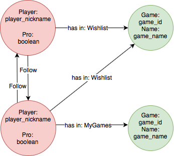
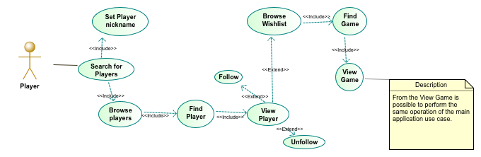

# Design of a social network for the GIAR application

## Table of contents
1) [Introduction](#1-introduction)
2) [Functional requirements](#2-functional-requirements)
3) [Non-Functional requirements](#3-non-functional-requirements)
4) [Snapshot of the graph](#4-snapshot-of-the-graph)
5) [Analysis Classes Diagram](#5-analysis-classes-diagram)

# 1. Introduction
The social network feature allow a player to follow and to be followed by other players. A player can see the Wishlist of the players they follow, in order to discover new games from players that share similar interests. A player who has a lot of interaction with the system can receive the PRO badge, as a reward of his interactivity with the platform.

# 2. Functional requirements
This section defines the services that the system provides to the users. To every functional requirement is assigned a unique key `FNC-nnn` where *nnn* is a sequence number identifying the functional requirement. The following table lists all the functional requirements:

Functional Requirement | Description
------------ | -------------
FNC-017 | A `player` shall be able to search for other players and follow or unfollow them.
FNC-018 | A `player` shall be able to see the wishlist of the players he follows.
FNC-019 | A `player` shall be able to see the PRO badge in the home page if he is a PRO. 
FNC-020 | The system shall set as PRO a `player` who has an high centrality measure.

# 3. Non-Functional requirements
There aren't additional non-functional requirements.

# 4. Snapshot of the graph

# 5. Analysis Classes Diagram
The are no substantial differences with the classes diagram defined in [Design](./Design.md).

# 6. Use case diagram

# 7. Queries
## 7.1 On-graph queries
Domain-specific query | Graphic-centric query
----------------------|----------------------
Which games has `player_nickname` in his Wishlist? | Which vertixes with `has in: wishlist` edges are incident to `player_nickname` vertex?
How well connected is `player_nickname` in GIAR? | What is the centrality measure of `player_nickname` vertex?

## 7.2 CRUD operations
Operation | Description
----------|------------
Create | The system creates a player vertex for each player registered to the application.
Read | The system reads if a player is a PRO at the player log-in to show the PRO badge.
Update | The system updates the `has in:` relation if a player puts a game from the Wishlist to MyGames. The system updates the PRO property if a player becomes pro.
Delete | If a player deletes the profile, the system deletes the player vertex. If an administrator deletes a game, the system deletes the game vertex. 
