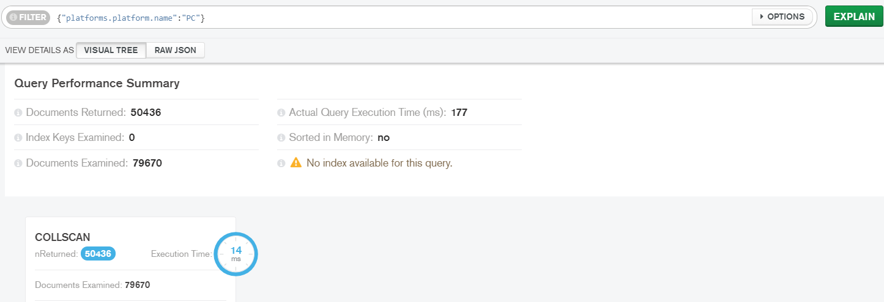
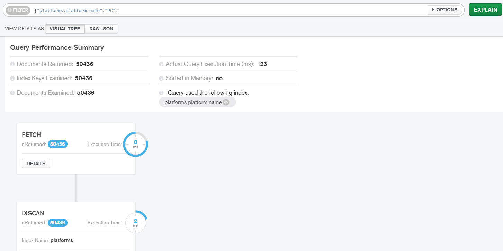
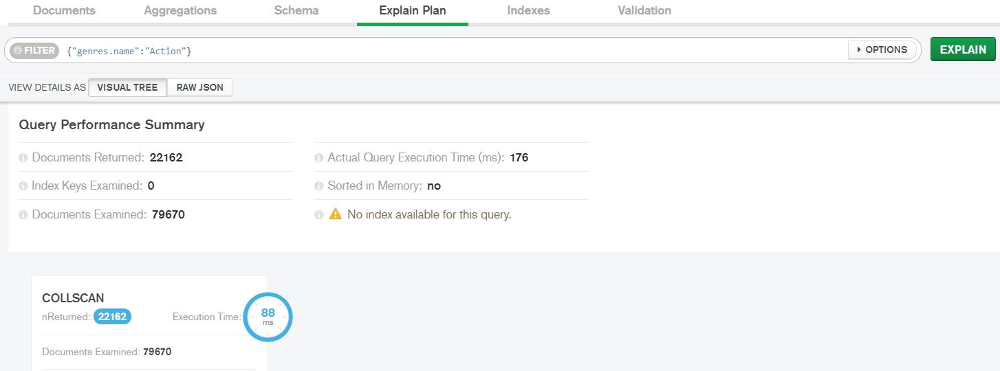
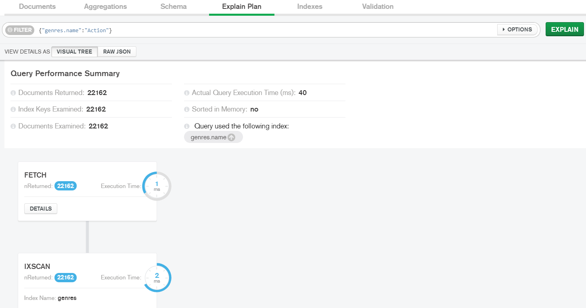
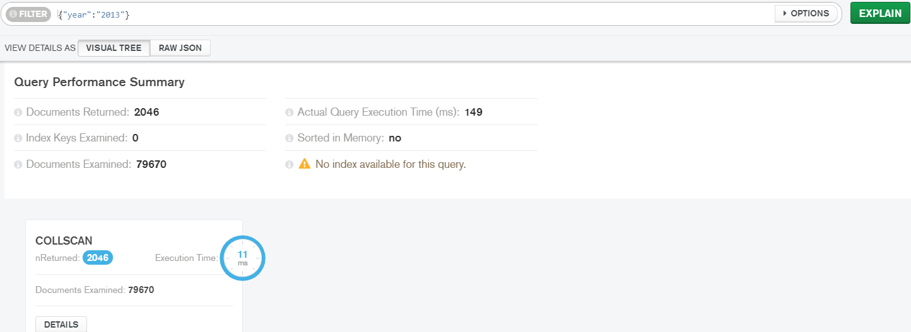
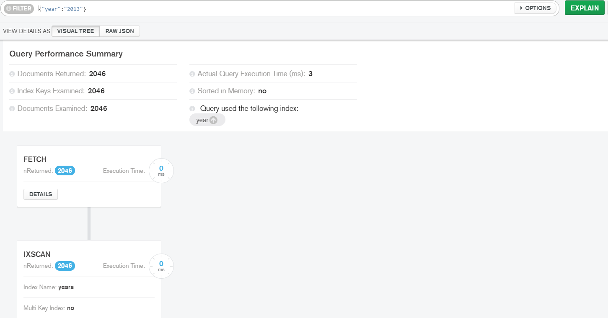

# Study on Query Performances for Indexes creation

## Table of contents
1) [Introduction](#1-introduction)
2) [platforms platform name](#2-platforms-platform-name)
3) [genres name](#3-genres-name)
4) [year](#4-year)

## 1. Introduction
The MongoDd Compass Explain Plan section offers the possibility to evaluate the query performance executed on the database. We used this feature to compare the performance between queries that exploit the indexes or not.

This is a study on the comparison of Query Performances on the collection `games` of our `giar` database in MongoDb.
We compare the results on the same queryes executed before and after the creation of the index.

In the tables the `Average Actual Query Execution Time(ms)` field is the average time obtained on a sample of 10 executions.

## 2. platforms platform name
In this section we study the index on the `platforms.platform.name` field of the games collection.
The queries executed for different values are: 
````
giar.games.find({platforms.platform.name: "PC"})
giar.games.find({platforms.platform.name: "PlayStation 3"})
giar.games.find({platforms.platform.name: "Xbox"})
````

### 2.1 PC

Used Index | Documents Returned | Index Keys Examinated | Documents Examined | Average Actual Query Execution Time(ms) 
------------ | ------------ | ------------ | ------------ | ------------ 
no index used | 50436 | 0 | 79670 | 172.6 
`platforms.platform.name` | 50436 | 50436 | 50436 | 136.4 

### 2.2 PlayStation 3 

Used Index | Documents Returned | Index Keys Examinated | Documents Examined | Average Actual Query Execution Time(ms) 
------------ | ------------ | ------------ | ------------ | ------------ 
no index used | 2357 | 0 | 79670 | 179.3 
`platforms.platform.name` | 2357 | 2357 | 2357 | 5.3 

### 2.3 Xbox 

Used Index | Documents Returned | Index Keys Examinated | Documents Examined | Average Actual Query Execution Time(ms) 
------------ | ------------ | ------------ | ------------ | ------------ 
no index used | 20 | 0 | 79670 | 177.4 
`platforms.platform.name` | 20 | 20 | 20 | 0

### 2.4 Screenshots
Example images of the results on an execution

Without index:

With index:



## 3. genres name
In this section we study the index on the `genres.name` field of the games collection.
The queries executed for different values are: 
````
giar.games.find({genres.name: "Action"})
giar.games.find({genres.name: "Shooter"})
````

### 3.1 Action Query Performances Summary

Used Index | Documents Returned | Index Keys Examinated | Documents Examined | Average Actual Query Execution Time(ms) 
------------ | ------------ | ------------ | ------------ | ------------ 
no index used | 22162 | 0 | 79670 | 171 
`genres.name` | 22162 | 22162 | 22162 | 81.3 

### 3.2 Shooter Query Performances Summary

Used Index | Documents Returned | Index Keys Examinated | Documents Examined | Average Actual Query Execution Time(ms) 
------------ | ------------ | ------------ | ------------ | ------------ 
no index used | 4210 | 0 | 79670 | 175.1 
`genres.name` | 4210 | 4210 | 4210 | 10 

### 3.3 Screeshots
Example images of the results on an execution:

Without index:

With index:



## 4. year
In this section we study the index on the `year` field of the games collection.
The query executed is: 
````
giar.games.find({year: "2013"})
````

### 4.1 Action Query Performances Summary

Used Index | Documents Returned | Index Keys Examinated | Documents Examined | Average Actual Query Execution Time(ms) 
------------ | ------------ | ------------ | ------------ | ------------ 
no index used | 2046 | 0 | 79670 | 171 
`year` | 2046 | 2046 | 2046 | 4 


### 4.2 Screeshots
Example images of the results on an execution:

Without index:

With index:

