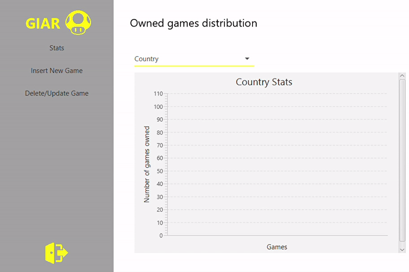
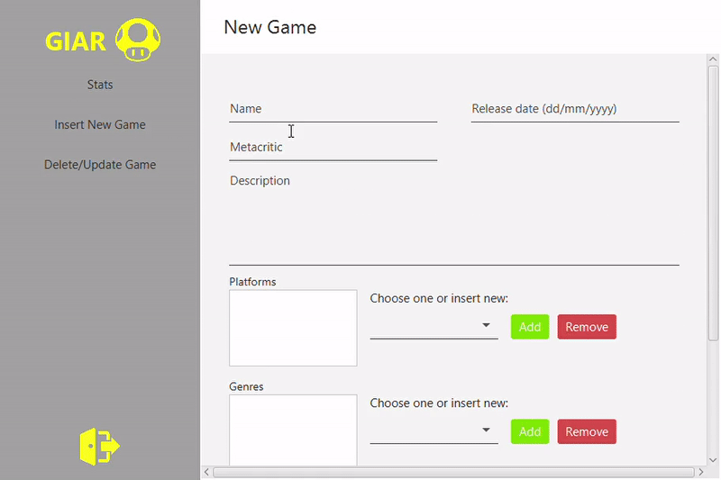
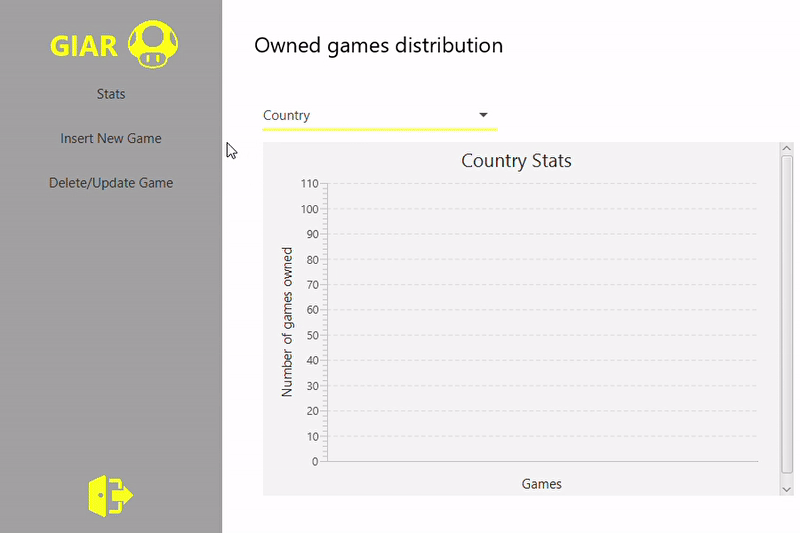
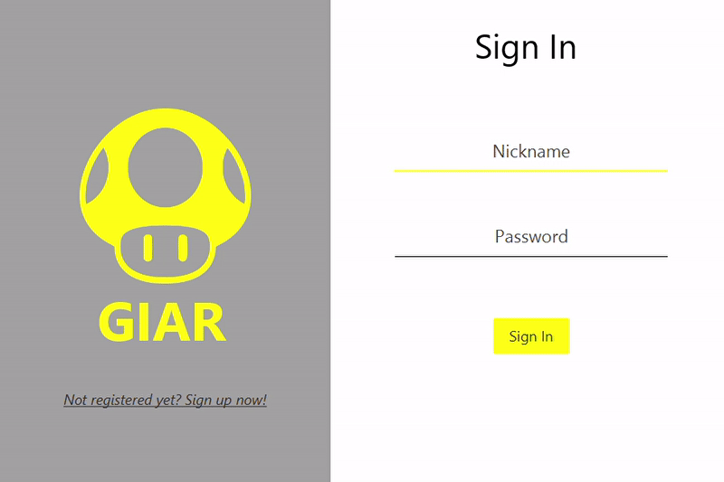
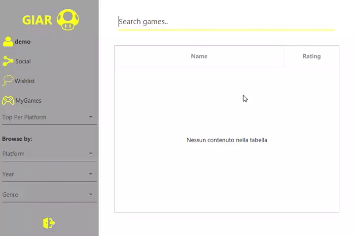
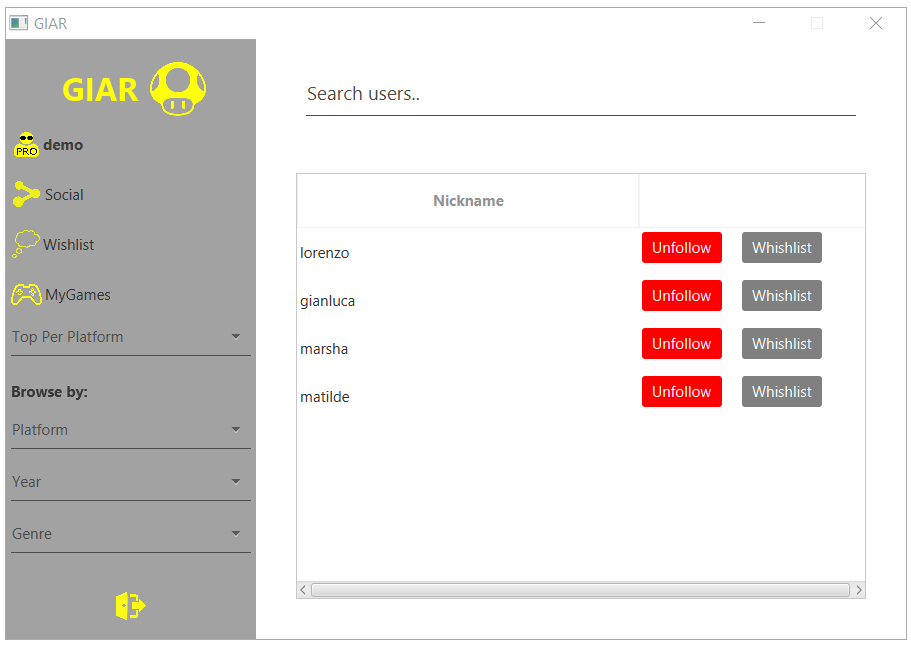
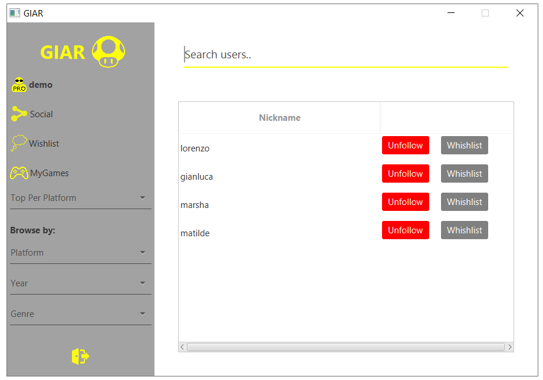
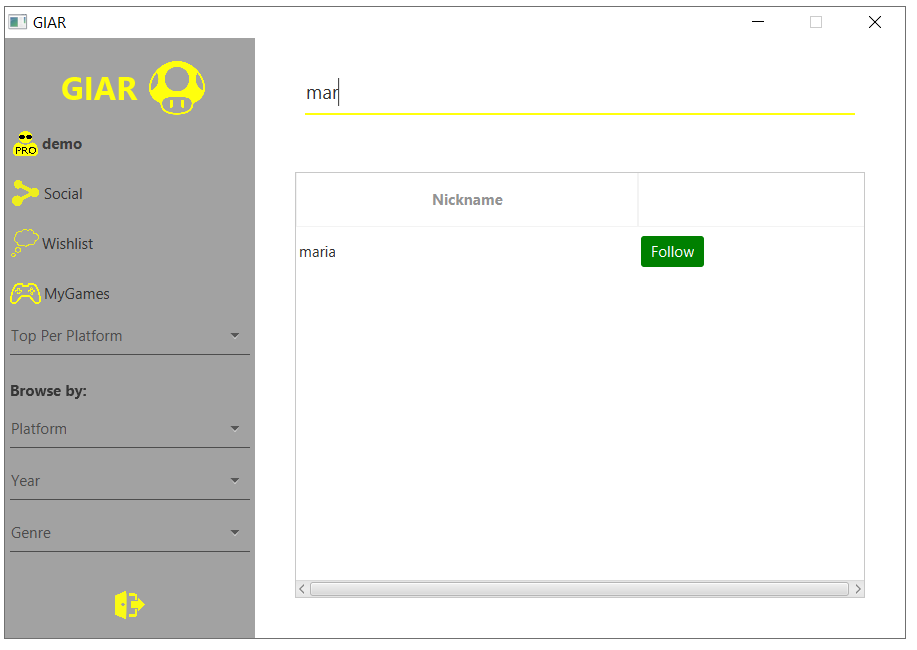
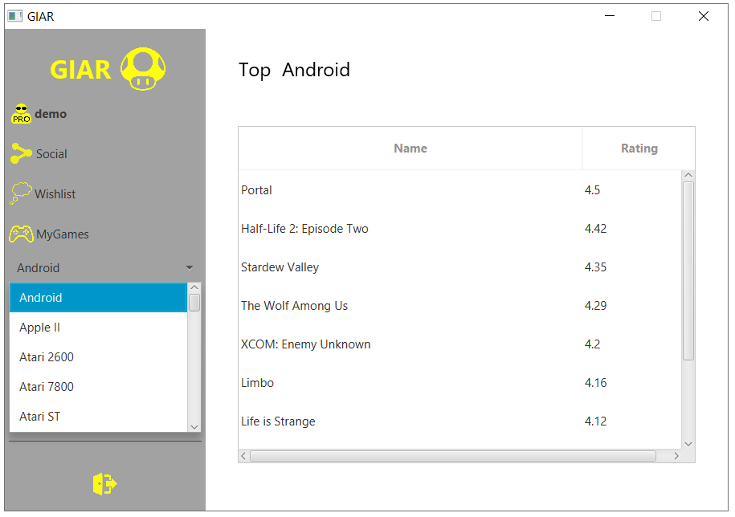
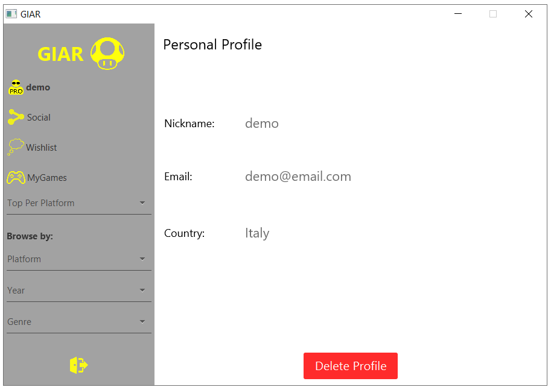

# User Manual

## Table of Contents

1. [System Overview](#1-system-overview)
2. [Administration Overview](#2-administration-overview)
3. [Player Overview](#3-player-overview)

## 1. System Overview

GIAR (Games information and Ratings) is a video game discovery platform and a community-powered database with over 70.000 games across half a hundred platforms that collects information and videogames ratings. We also host the best video games powered by you.

The System Allows:

**An Administrator to:**

- View statistics
- Adding a New Game
- Update Game
- Delete Game

**A Player User to:**

- Register an Account
- Delete the owner account
- Search a Game
- View the Top List by Platform of all register Games
- Connecting with other players by the private social network
- Make a Wishlist
- Make a List with your Games
- Preference Browse options

## 2. Administration Overview

Administrator is a special user who can insert, modify and delete games from the system. Administrator doesn't have the possibility to rate a game or have a list of personal games.

### 2.1 Log in

A database user named `admin` is created upon installation of GIAR. It's the only one user with Administrator access on the system.

- User name: `admin`
- Credentials: `admin`

### 2.2 Stats

Administrator can also see information about users games preferences grouped by country and how many users added a game in the Wishlists or in MyGames lists.

Click on `Stats` on the left section. Select a country according your needs.

### 2.3 Adding Game

For register a new game click on `Insert New Game` on the left section. Complete the form. Enter the name, release date, description, platforms, genres and developers.

### 2.4 Update Game

The Administrator user can change the game information. He can change the release date, description, platforms, genres and developers. A confirmation message displays.

### 2.5 Delete Game

For delete a game, the administrator have to click on the `Delete/Update Game` on the left section. Search the game you want to delete. Open the information of the game and press the `Delete` button. A confirmation message displays.

## 3. Player Overview

A Player user has two personal lists: MyGames and WishList. The first is referred to the games that the user has bought, the second is a list of games that the user wants to buy in the future. The user can add a game in one of these lists from the specific page of the game, and delete one game from a list accessing to the relative section.

### 3.1 Sign up

If you are a new user, you can register your own account.
On the Login page, click on the link `Not registered yet? Sign up now!`

Fill all the Sign Up form with your name, email, country, and Password.

### 3.2 Sign in

A user needs an account to access the platform. If a user already has an account, insert the Nickname and the Password to access. Otherwise, view the previus section (3.1 Sign up).

### 3.3 Search

A user can search a game by name using the search bar on the top of the homepage.

### 3.4 Social Network

Go to `Social` on the left section. In this section you can access on a Private Social Network specially made for create a community-powered. 

You can access and see the WishList of all your other friends just clicking on the gray button Wishlist.

For adding more friends, you just have to search by nickname your friends and click on the following button.

### 3.5 Rating

The users with the Player role can rate every games. Click on the game information and add your preference rating.
When you add or change your rating number, instantanly change the global general rating. Amazing!

### 3.6 Adding to MyGames

Giar is the best place for administrate your games list. When you buy a game, you can added to your list of `My Games`.

For do that, search your game name and click on the button `Add to MyGames`.

### 3.7 Adding to Wishlist

Giar is the best place for community games. You have the option to add to your `My Wish` list for make a public list with all the games you like but don't have.

For do that, search your game name and click on the button `Add to Wishlist`.

**Note:** For view the wishlist of your friends, click on `Social` section on the left of the menu. Click on the button of the wishlist of your friends. Otherwise, view the Social section (3.4 Social Network).

### 3.8 Top Game by Platform

Depend on the Global Rating, you can vizualice the Top Games by Platform. For show the best 10 games on the GIAR Platform, click on `Top Per Platform` section on the left menu.

### 3.9 Browse Section

A user can browse a list of games choosing one of these filters: platform, year or genre. The user can sort the list of the games by name or rating.

#### Browse by Platform

You can search all the games with an specific Platform.

#### Browse by Year

You can search all the games with an specific Year.

#### Browse by Genre

You can search all the games with an specific Genre.

### Delete Profile

For Delete your Profile, on the left menu, click on you nickname. Your personal information will be display. Click on the `Delete Profile` button. A confirmation message will be displayed.

